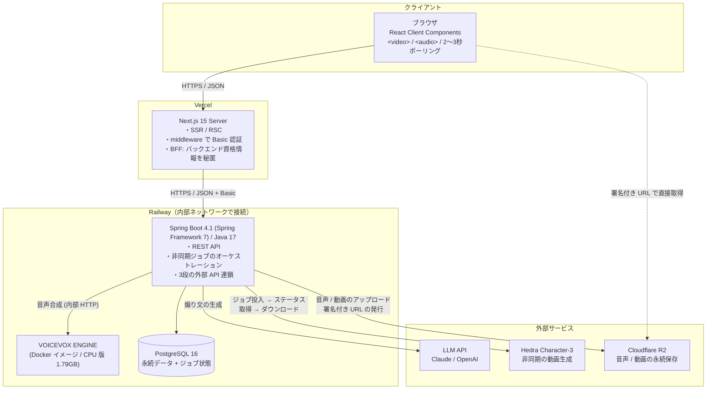
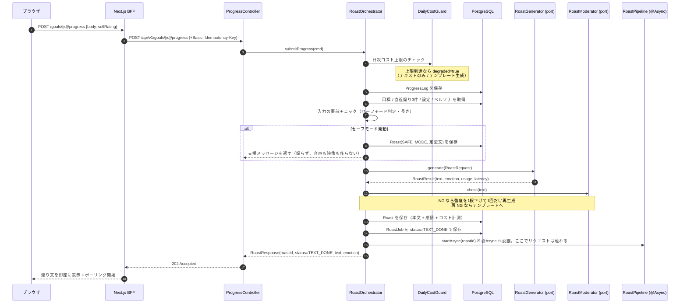
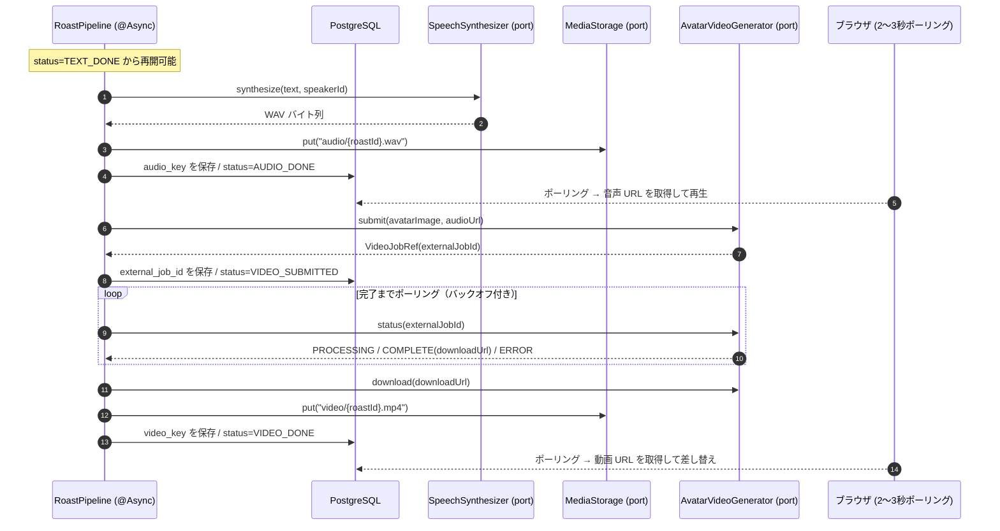
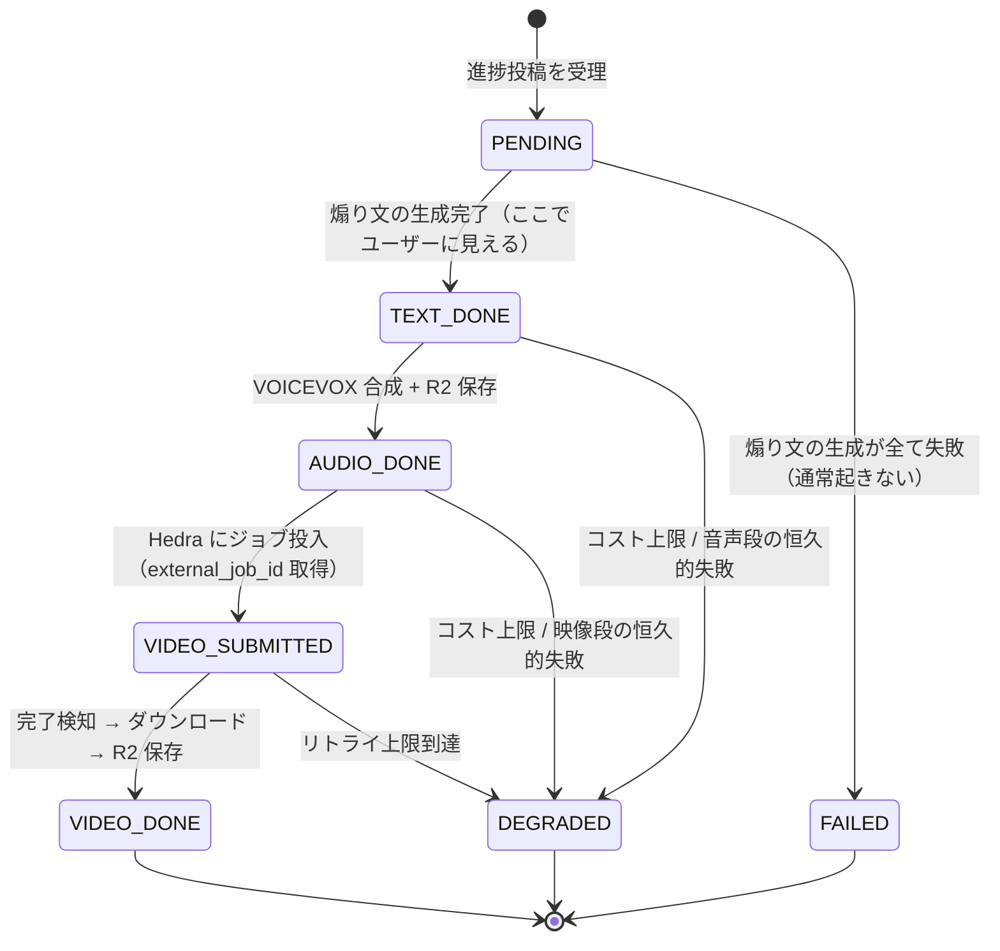
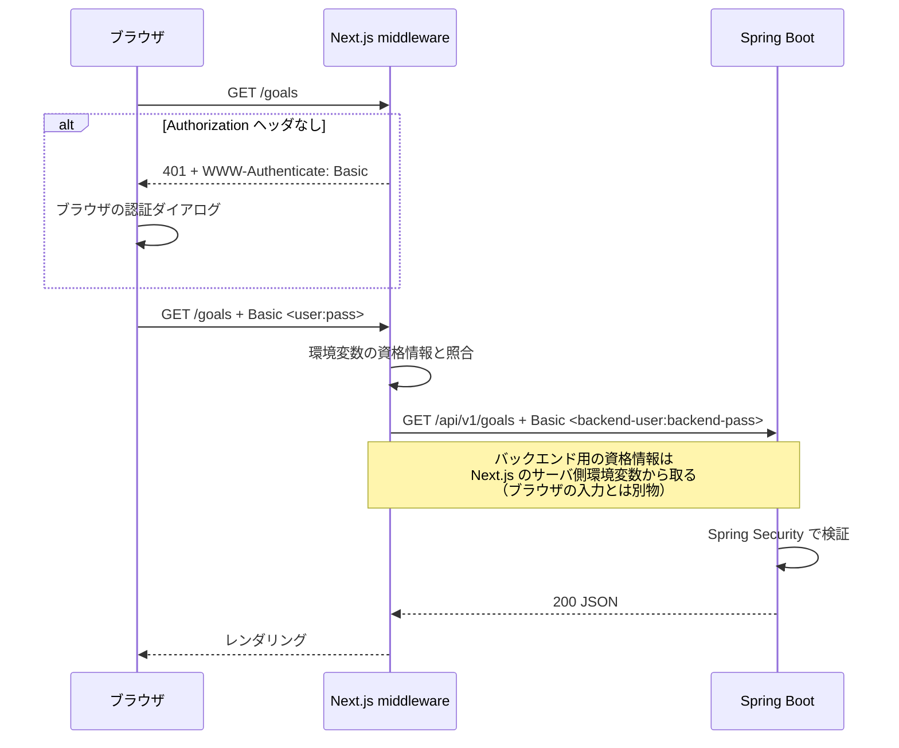

# 02. アーキテクチャ設計

> **v1 のスコープと、削った機能の理由は [README](./README.md) を参照。**

## 1. システム構成



### 構成の意図

- **Next.js を BFF として置く**: バックエンドの Basic 認証資格情報と、すべての外部 API キーをブラウザから隔離する。ブラウザは Next.js としか話さない。
- **Spring Boot は非同期パイプラインのオーケストレーションに専念**: 本アプリの技術的な中身はここに集中する。3つの外部 API を、段階的に、耐障害的に繋ぐ。
- **VOICEVOX は Railway の内部ネットワークに置く**: 音声合成は毎回発生するため、外部 HTTP のレイテンシを避ける。**使用時のみ必要なコンポーネントなので、本来はゼロスケールできる環境（Cloud Run 等）が最適**（[07](./07-operations.md) §6）。
- **メディアは R2 から直接ブラウザへ**: バックエンドは署名付き URL を発行するだけにし、動画のバイト列をアプリサーバに通さない。
- **Redis を持たない**: 単一インスタンス・単一ユーザーではレート制限もキャッシュも DB とインメモリ（Caffeine）で足りる。運用コンポーネントを1つ減らす。【将来】複数ユーザー化時に再検討。

---

## 2. 技術スタック

### 2.1 バックエンド

| 分類 | 採用 | 備考 |
|---|---|---|
| 言語 | Java 17 (LTS) | Records / sealed interface / pattern matching を活用。Spring Boot 4.1 の対応範囲は Java 17〜26（[§2.4](#24-spring-boot-4-採用の影響) 参照） |
| フレームワーク | **Spring Boot 4.1.x** | Spring Framework 7 系 / Jakarta EE 11 / Servlet 6.1 |
| Web | Spring Web MVC (`spring-boot-starter-webmvc`) | 同期ブロッキングで実装。WebFlux は不要。**Java 17 では仮想スレッドは使えない**ため [07 §1.2](./07-operations.md) の対策を必須とする |
| 永続化 | Spring Data JPA (Hibernate 7) | 複雑なクエリは `JdbcClient` を局所併用。jOOQ は Boot 4.1 の管理バージョン（3.21）が Java 21 必須のため採らない |
| マイグレーション | Flyway | `V1__init.sql` から連番管理 |
| 認証 | Spring Security 7 / **HTTP Basic** | 単一ユーザー。Lambda DSL のみ（`and()` 廃止）。【将来】OAuth2 Resource Server へ差し替え |
| バリデーション | Jakarta Bean Validation 3.1 | |
| 非同期 | Spring `@Async` + 専用 `ThreadPoolTaskExecutor` | 3段パイプラインの実行。**Boot 4.1 のコンテキスト自動伝播**により `TaskDecorator` の自前実装が不要 |
| ジョブ復旧 | Spring `@Scheduled` | 停滞ジョブの検出と再開（[§5](#5-非同期パイプライン設計-中核)） |
| レジリエンス | **Spring Framework 7 標準**（`@Retryable` / `@ConcurrencyLimit` / `RetryTemplate`） | `@EnableResilientMethods` で有効化。**Resilience4j 依存を持たない**（[§7](#7-障害時のふるまい)） |
| JSON | Jackson 3 (`tools.jackson`) | Boot 4 の既定（[§2.4](#24-spring-boot-4-採用の影響)） |
| LLM クライアント | Anthropic Java SDK (`com.anthropic:anthropic-java`) | Claude アダプタ専用 |
| その他 HTTP | `RestClient` / **HTTP Service Clients**（`@ImportHttpServices` + `@HttpExchange`） | OpenAI / VOICEVOX / Hedra は宣言的インタフェースで書く |
| オブジェクトストレージ | AWS SDK for Java v2（S3 クライアント） | **Cloudflare R2 は S3 互換**。エンドポイントを差し替えるだけ |
| マッピング | MapStruct | Entity ↔ DTO |
| 監視 | Spring Boot Actuator + Micrometer | Prometheus 形式でエクスポート |
| テスト | JUnit 5 / AssertJ / Testcontainers / WireMock / `RestTestClient` | 外部 API は WireMock でスタブ。モック Bean は `@MockitoBean`（`@MockBean` は Boot 4 で削除） |
| ビルド | Gradle 9 (Kotlin DSL) | Boot 4.1 は Gradle 8.14+ / 9.x に対応 |

### 2.2 フロントエンド

**前提: React / TypeScript / Next.js はいずれも未経験。** 学習コストを抑えるため、v1 では**使う概念を意図的に絞る**。

| 分類 | 採用 | 備考 |
|---|---|---|
| 言語 | TypeScript 5.x (strict) | |
| フレームワーク | Next.js 15 (App Router) | BFF・SSR のために採用 |
| UI | React 19 | |
| スタイル | Tailwind CSS | shadcn/ui は必要になった時点で導入。**最初から入れない** |
| サーバ状態 | TanStack Query v5 | **ポーリングは `refetchInterval` で書ける**（[06](./06-frontend-design.md) §3）。自前の `setInterval` を書かないための採用 |
| クライアント状態 | React の `useState` のみ | **Zustand は入れない。** v1 の UI 状態は画面ローカルで足り、状態管理ライブラリを1つ学ぶコストに見合わない |
| 認証 | なし（Basic 認証を middleware で処理） | Auth.js は【将来】 |
| アバター描画 | ``（待機時）+ `<video>`（生成完了時） | **Live2D / PixiJS は v1 では使わない**（[06](./06-frontend-design.md) §5） |
| フォーム | 素の `<form>` + Zod | React Hook Form は【将来】 |
| テスト | Vitest | Playwright は【将来】 |

### 2.3 インフラ

| 分類 | 採用 | 備考 |
|---|---|---|
| フロント | **Vercel** | Next.js の標準ホスティング。無料枠で足りる |
| バックエンド | **Railway** | Spring Boot コンテナ |
| VOICEVOX | **Railway**（Docker イメージ指定でサービスとして起動） | `voicevox/voicevox_engine:cpu-*`。内部ネットワークで Spring から呼ぶ |
| DB | **Railway PostgreSQL** | 同一プロジェクト内に立てる |
| メディア保存 | **Cloudflare R2** | S3 互換、**egress 無料**、10GB 無料枠 |
| シークレット | Railway / Vercel の環境変数 | API キー一式 |
| CI | GitHub Actions | ビルドとテストのみ。デプロイは Railway / Vercel の Git 連携に任せる |

**Railway を選んだ理由と、選ばなかった選択肢**は [README](./README.md) の「選ばなかった選択肢」を参照。要点は「Cloud Run のゼロスケールの方が本設計には最適だが、インフラ未経験での工数リスクを取らない」。

**R2 の容量試算**: 10秒の動画 ≈ 1〜2MB。1日5本を1年続けて 1,825本 ≈ 3GB。**無料枠（10GB）に収まる。**

### 2.4 Spring Boot 4 採用の影響

新規プロジェクトなので移行コストは発生しないが、Spring Boot 3 系の記事・サンプルをそのまま写すと動かない箇所があるため、実装前に共有すべき差分を明示しておく。

#### 2.4.1 前提バージョン

| 項目 | 値 |
|---|---|
| Spring Boot | 4.1.x（4.1.1 が最新安定版。2026-06 GA） |
| Spring Framework | 7.0.9 以上 |
| Java | **最小 17 / 最大 26**（本プロジェクトは要件どおり 17 で開始） |
| Jakarta EE | 11（Servlet 6.1 / Persistence 3.2 / Validation 3.1） |
| サーブレットコンテナ | Tomcat 11.0.x（**Undertow はサポート対象外**） |
| ビルド | Gradle 8.14+ または 9.x / Maven 3.6.3+ |

> Spring Boot 4 は Java 21 を要求しない。**要件の Java 17 のまま採用できる**。ただし仮想スレッドは依然 Java 21 以降の機能であり、本アプリの弱点（外部 API のブロッキング呼び出し）には効かない。[07 §1.2](./07-operations.md) の対策は Boot 4 でも必要。

#### 2.4.2 依存名の変更（そのまま `build.gradle.kts` に効く）

| 用途 | Boot 3 での名前 | **Boot 4 での名前** |
|---|---|---|
| Web MVC | `spring-boot-starter-web` | **`spring-boot-starter-webmvc`** |
| OAuth2 リソースサーバ【将来】 | `spring-boot-starter-oauth2-resource-server` | **`spring-boot-starter-security-oauth2-resource-server`** |
| AOP | `spring-boot-starter-aop` | **`spring-boot-starter-aspectj`** |
| Actuator | `spring-boot-starter-actuator` | 同名（テスト用に `-actuator-test` が追加） |
| Security テスト | `spring-security-test` を直接 | **`spring-boot-starter-security-test`**（`@WithMockUser` 利用に必要） |
| Data JPA | `spring-boot-starter-data-jpa` | 同名 |

Boot 4 では「1 技術 1 スタータ + 対応する `-test` スタータ」に整理された。テスト依存は `spring-boot-starter-test` 一本ではなく、使う技術ごとの `-test` スタータを足す方針で書く。

#### 2.4.3 Jackson 3 への移行

Boot 4 の既定 JSON ライブラリが Jackson 3 になり、**パッケージが `com.fasterxml.jackson` → `tools.jackson` に変わる**。

- `Jackson2ObjectMapperBuilderCustomizer` → `JsonMapperBuilderCustomizer`
- `@JsonComponent` → `@JacksonComponent` / `@JsonMixin` → `@JacksonMixin`
- プロパティ `spring.jackson.read.*` → `spring.jackson.json.read.*`（write も同様）

**注意点**: [05](./05-llm-design.md) の構造化出力スキーマは `@JsonPropertyDescription` などのアノテーションに依存するが、これは Anthropic Java SDK 側（Jackson 2 系）が解釈するものであり、Spring の Jackson 3 とは別系統。パッケージ名が異なるため両者は同一クラスパス上に共存できるが、**`RoastOutput` に付けるアノテーションは SDK が要求する `com.fasterxml.jackson.*` 側である**点を実装時に取り違えないこと。Spring の `@RestController` が返す DTO 側は `tools.jackson.*` を使う。

#### 2.4.4 新機能で設計が変わる箇所

| 機能 | 本アプリでの使い所 |
|---|---|
| **標準レジリエンス**（`@Retryable` / `@ConcurrencyLimit`） | **3つの外部 API すべて**のリトライと同時実行制限。Resilience4j を依存から外せる（[§7](#7-障害時のふるまい)） |
| **`@Async` のコンテキスト伝播**（4.1） | 非同期パイプラインの実行スレッドにトレース ID が引き継がれる。**3段連鎖のトレースが1本に繋がる**のは可観測性上とくに大きい |
| **HTTP Service Clients**（`@ImportHttpServices` + `@HttpExchange`） | **OpenAI / VOICEVOX / Hedra の3アダプタで採用。** SDK のない相手を宣言的インタフェースで書けるため、アダプタ実装コストが大きく下がる |
| **SSRF 対策 `InetAddressFilter`**（4.1） | 外部 API 呼び出し先をホワイトリスト制御。Anthropic / OpenAI / Hedra / R2 のドメインのみ許可 |
| **JSpecify による null 安全** | `domain` パッケージのポート定義に `@NullMarked` を付け、null 契約を明示する |
| **`RestTestClient`** | コントローラ層テストの標準手段として採用 |
| **API バージョニング**（`spring.mvc.apiversion.*`） | 現状はパス `/api/v1` で固定。**v2 が必要になるまで導入しない**（BFF が唯一のクライアント） |

---

## 3. バックエンドのパッケージ構成

ドメインごとの**パッケージ・バイ・フィーチャー**を採り、その内側でヘキサゴナル（ポート/アダプタ）に分ける。**外部 AI を差し替え可能にするのが本アプリの肝**なので、`roast` パッケージだけは特に厳密に境界を守る。

```
com.example.roastme
├── RoastMeApplication.java
├── config/
│   ├── SecurityConfig.java              # HTTP Basic（Lambda DSL）
│   ├── LlmConfig.java                   # RoastGenerator の選択と合成
│   ├── SpeechConfig.java                # SpeechSynthesizer（VOICEVOX）
│   ├── VideoConfig.java                 # AvatarVideoGenerator（Hedra）
│   ├── StorageConfig.java               # R2（S3 互換クライアント）
│   ├── AsyncConfig.java                 # @EnableAsync / パイプライン用スレッドプール
│   ├── ResilienceConfig.java            # @EnableResilientMethods / InetAddressFilter
│   ├── JpaConfig.java
│   └── properties/                      # @ConfigurationProperties 群
│
├── common/
│   ├── error/                           # GlobalExceptionHandler, ProblemDetail 生成
│   ├── ratelimit/                       # RateLimiter（DB カウンタ + Caffeine）
│   ├── cost/                            # DailyCostGuard（日次上限と縮退判定）
│   └── util/
│
├── user/                                # v1 は単一ユーザーだがテーブルとポートは持つ
│   ├── api/ / application/ / domain/ / infrastructure/
│
├── goal/
│   ├── api/       GoalController, dto/
│   ├── application/  GoalService, GoalStatusTransition
│   ├── domain/    Goal, GoalStatus(enum), GoalRepository(port)
│   └── infrastructure/
│
├── roast/                               ★ コア
│   ├── api/
│   │   ├── ProgressController.java      # 進捗投稿 → 202 Accepted
│   │   ├── RoastController.java         # 状態のポーリング・履歴・リアクション
│   │   └── dto/
│   ├── application/
│   │   ├── RoastOrchestrator.java       # 同期部分（煽り文まで）
│   │   ├── RoastPipeline.java           # ★ 非同期部分（音声 → 映像 → 保存）
│   │   ├── RoastJobRecoveryScheduler.java # ★ @Scheduled で停滞ジョブを再開
│   │   ├── RoastContextBuilder.java     # LLM に渡す文脈の組み立て
│   │   ├── AngerGaugeService.java
│   │   └── RoastFallbackPolicy.java
│   ├── domain/
│   │   ├── Roast.java, RoastTrigger.java(enum), RoastEmotion.java(enum)
│   │   ├── RoastJob.java, RoastJobStatus.java(enum)   # ★ ジョブの状態
│   │   ├── RoastRequest.java (record)   # プロバイダ非依存の入力
│   │   ├── RoastResult.java  (record)   # 本文 + 感情 + 使用量メトリクス
│   │   ├── SpeechRequest.java / SpeechResult.java     # 音声のポート型
│   │   ├── VideoRequest.java  / VideoJobRef.java / VideoResult.java
│   │   ├── RoastGenerator.java          # ★ ポート（出力）
│   │   ├── SpeechSynthesizer.java       # ★ ポート（出力）
│   │   ├── AvatarVideoGenerator.java    # ★ ポート（出力）
│   │   ├── MediaStorage.java            # ★ ポート（出力）
│   │   ├── RoastModerator.java          # ★ ポート（出力）
│   │   ├── RoastRepository.java         # ★ ポート（出力）
│   │   └── RoastJobRepository.java      # ★ ポート（出力）
│   └── infrastructure/
│       ├── llm/
│       │   ├── claude/ClaudeRoastGenerator.java
│       │   ├── openai/OpenAiRoastGenerator.java       # HTTP Service Client
│       │   ├── template/TemplateRoastGenerator.java   # フォールバック
│       │   └── CompositeRoastGenerator.java           # 主系→フォールバック の合成
│       ├── speech/voicevox/VoicevoxSpeechSynthesizer.java
│       ├── video/hedra/HedraVideoGenerator.java       # 投入 / 状態取得 / 取得
│       ├── storage/r2/R2MediaStorage.java             # S3 互換クライアント
│       ├── moderation/  KeywordModerator, LlmModerator
│       └── persistence/ JpaRoastRepository, JpaRoastJobRepository, RoastEntity, RoastJobEntity
│
└── persona/
    ├── domain/ / infrastructure/
    └── prompt/                          # ペルソナ別プロンプト（resources/prompts/ を読む）
```

### レイヤ間の依存ルール

```
api ──▶ application ──▶ domain ◀── infrastructure
```

- `domain` は他レイヤに依存しない（Spring にも依存しないプレーン Java）。
- `infrastructure` は `domain` のポートインタフェースを実装する。
- `api` は `domain` を直接触らず `application` の DTO 越しに扱う。
- **`domain` から Anthropic SDK / AWS SDK / Hedra のレスポンス型が見えたら設計違反**。SDK 型は各 `infrastructure/*` に閉じ込める。

ArchUnit テストでこの依存規則を CI で検証する。

### ポートを3本に増やしたことの意味

v1 の外部依存は LLM だけではない。**同じポート/アダプタのパターンを3回繰り返す**ことで、抽象化が「LLM 用の特殊対応」ではなく設計方針であることが構造から読み取れる。

| ポート | v1 の実装 | 【将来】差し替え候補 |
|---|---|---|
| `RoastGenerator` | `ClaudeRoastGenerator` / `OpenAiRoastGenerator` / `TemplateRoastGenerator` | 他の LLM、ローカルモデル |
| `SpeechSynthesizer` | `VoicevoxSpeechSynthesizer` | 商用 TTS、映像 API の内蔵 TTS |
| `AvatarVideoGenerator` | `HedraVideoGenerator`（Character-3） | Hedra Live Avatars、実写系サービス（Q10） |
| `MediaStorage` | `R2MediaStorage` | S3 / GCS（S3 互換なので実装はほぼ共通） |

---

## 4. 中核ユースケース: 進捗報告 → 煽り

### 4.1 同期部分（投稿 → 煽り文）



**設計の要点**: 煽り文までは同期で返す。**ここを非同期にすると体験が悪化するだけで得るものがない。** 同期と非同期の境界を意図的に「テキストの完成時点」に引く。

### 4.2 非同期部分（音声 → 映像 → 保存）



### 4.3 `RoastOrchestrator` / `RoastPipeline` の責務分担

| クラス | 責務 |
|---|---|
| `RoastOrchestrator`（同期） | コスト上限チェック / 入力の安全判定 / 文脈の組み立て / 煽り文の生成と出力ガード / `Roast` と `RoastJob` の永続化 / パイプラインの起動 |
| `RoastPipeline`（非同期） | 音声合成 → 保存 → 映像投入 → 完了待ち → ダウンロード → 保存。**各段の完了ごとにジョブ状態を DB へ書く** |
| `RoastJobRecoveryScheduler` | 一定時間更新のない非終端ジョブを拾い、**その段階から**再開する |

**この 3 クラスは外部プロバイダに依存しない。** プロバイダ差し替えの影響は `infrastructure/*` に閉じる。

### 4.4 煽りトリガーの一覧

| トリガー | 起点 | 映像生成 | 特徴 |
|---|---|---|---|
| `GOAL_DECLARED` | 目標作成 API | あり | 「どうせ続かない」系。期待値を下げて反発を誘う |
| `PROGRESS_REPORTED` | 進捗投稿 API | あり | **中核**。進捗の質で分岐。良い進捗でも素直に褒めない |
| `GOAL_ACHIEVED` | 達成 API | **なし（v1）** | 悔しがる / 渋々認める。**v1 はテキストのみ**（[README](./README.md) 参照）。【将来】動画化 |
| `GOAL_ABANDONED` | 放棄 API | なし | セーフモード時は無効。追い打ちは 1回限り |
| `DEADLINE_EXTENDED` | 目標編集 API | なし | 期限を後ろ倒しした瞬間に煽る |
| `SAFE_MODE` | 入力ガード発動時 | なし | 煽らない。定型文 + 支援リソース |
| `STALLED` / `DEADLINE_NEAR` | 【将来】バッチ | なし | v1 では自動通知を持たない |

---

## 5. 非同期パイプライン設計 ★中核

**本アプリの技術的な主題。** 3段の外部 API 連鎖を、ユーザーを待たせず、途中で落ちても再開できる形にする。

### 5.1 ジョブ状態



| 状態 | 意味 | ユーザーに見えるもの |
|---|---|---|
| `PENDING` | 受理済み、煽り文の生成中 | ローディング |
| `TEXT_DONE` | 煽り文が完成 | **テキスト**（ここで刺さる） |
| `AUDIO_DONE` | 音声が R2 に保存済み | テキスト + **音声** |
| `VIDEO_SUBMITTED` | Hedra 側で生成中 | テキスト + 音声（動画は待機表示） |
| `VIDEO_DONE` | 動画が R2 に保存済み | テキスト + **動画** |
| `DEGRADED` | 途中段階で確定した（正常終了の一種） | そこまでの成果物 |
| `FAILED` | 何も返せなかった | エラー表示（設計上ほぼ起きない） |

**`DEGRADED` は失敗ではなく正常系の1つ。** コスト上限に到達した日は全ジョブが `TEXT_DONE → DEGRADED` になる。ユーザーには「今日はテキストだけ」として自然に見える。

### 5.2 再開可能性（Q19 の中身）

各段の完了時に**必ず DB へ書き込む**ため、プロセスがどこで落ちても状態が残る。

```
RoastJobRecoveryScheduler（例: 60秒ごと）
  └─ status ∈ {PENDING, TEXT_DONE, AUDIO_DONE, VIDEO_SUBMITTED}
     かつ updated_at < now() - 閾値
     のジョブを取得し、その status に応じた段から再実行する
```

| 落ちた場所 | 再開時の動作 |
|---|---|
| 煽り文の生成中 | `PENDING` から再実行。**LLM を1回余分に呼ぶ**（許容） |
| 音声合成中 | `TEXT_DONE` から再実行。VOICEVOX は無料なので損失なし |
| 映像の投入前 | `AUDIO_DONE` から再実行。**音声は再生成しない**（R2 に保存済み） |
| 映像の生成待ち中 | `VIDEO_SUBMITTED` から**投入せずに状態取得だけ再開**。`external_job_id` を保存してあるため、**課金済みのジョブを捨てない** ★ここが要点 |
| ダウンロード中 | `VIDEO_SUBMITTED` から再開。Hedra 側は完了済みなので取得のみ |

> **`external_job_id` を永続化することが、この設計で最も価値のある1行**である。これがないと、Railway の再デプロイのたびに課金済みの動画生成が消える。

### 5.3 冪等性

- 各段は**同じジョブに対して複数回実行されても安全**でなければならない（`@Scheduled` 復旧と `@Async` 本体が同時に走りうる）
- R2 のキーは `audio/{roastId}.wav` / `video/{roastId}.mp4` と決定的にし、上書きを許容する
- ジョブの取得は `SELECT ... FOR UPDATE SKIP LOCKED` で行い、二重処理を防ぐ
- Hedra への投入は `external_job_id` が既にある場合スキップする

### 5.4 スレッドの扱い

パイプラインは Tomcat のワーカースレッドから切り離した専用プールで動かす。

```java
// config/AsyncConfig.java
@Bean("roastPipelineExecutor")
ThreadPoolTaskExecutor roastPipelineExecutor() {
    var ex = new ThreadPoolTaskExecutor();
    ex.setCorePoolSize(2);
    ex.setMaxPoolSize(4);           // 1日3〜5本の想定なので小さくてよい
    ex.setQueueCapacity(50);
    ex.setThreadNamePrefix("roast-pipeline-");
    return ex;
}
```

- **Spring Boot 4.1 の `@Async` コンテキスト自動伝播**により、トレース ID が同期部分から非同期部分へ引き継がれる。3段連鎖のトレースが1本に繋がるため、可観測性が素直になる（Boot 3 時代の `TaskDecorator` 自前実装は不要）
- Hedra の完了待ちは**このスレッドを数分占有する**。同時本数が少ない v1 では許容する。【将来】本数が増えたら、完了待ちを `@Scheduled` のポーリングに寄せてスレッドを保持しない形へ変える

---

## 6. 認証・認可

### 【v1】Basic 認証



- **資格情報は 2 系統**: ブラウザ ↔ Next.js と、Next.js ↔ Spring。後者はブラウザに一切露出しない
- Spring 側は `users` テーブルに**単一ユーザーを seed**し、認証済みリクエストをそのユーザーに解決する。`user_id` 外部キーは全テーブルに残すため、【将来】の複数ユーザー化でクエリを書き換えずに済む
- **HTTPS 必須**（Basic は資格情報を平文で送るため）。Vercel / Railway とも既定で TLS
- **公開 URL を配らない**運用と併用する。Basic 認証は「他人が偶然たどり着いても入れない」ための最小限の錠であり、それ以上の強度は主張しない

> **1人用でも認証を外さない理由**: デプロイされたアプリは Anthropic / OpenAI / Hedra の API キーを保持し、リクエスト1回が実費を発生させる。**無認証で公開することは、他人に自分の財布を叩かせること**に等しい。

### 【将来】OIDC への移行

`spring-boot-starter-security-oauth2-resource-server` に差し替え、Next.js 側に Auth.js を入れる。`users.external_sub` カラムは v1 から用意してあるため、スキーマ変更は不要。

---

## 7. 障害時のふるまい

**方針: 各段は独立に失敗してよい。上流までの成果物は必ずユーザーに届く。**

| 障害 | ふるまい |
|---|---|
| LLM API がタイムアウト / 5xx | 2回まで指数バックオフ + ジッタでリトライ → それでも失敗ならテンプレート煽りを返す（**ユーザーには成功として見せる**）。`roasts.provider = 'template'` で記録 |
| LLM API がレート制限 (429) | `Retry-After` に従い 1回だけ待機 → 失敗時はテンプレート |
| LLM 呼び出しの同時実行過多 | `@ConcurrencyLimit` の上限を超えた分は待たせず即座にテンプレートへ倒す |
| モデレーションで 2回連続 NG | テンプレート煽りにフォールバック。`moderation_status` に記録 |
| **VOICEVOX が応答しない** | 2回リトライ → 失敗なら `DEGRADED`。**テキストは既に届いている**ので体験は成立する |
| **Hedra への投入が失敗** | 2回リトライ → 失敗なら `DEGRADED`（テキスト + 音声で確定） |
| **Hedra のジョブが完了しない / ERROR** | 上限時間（既定 10分）を超えたら `DEGRADED`。**課金分は諦めるが、体験は壊さない** |
| **R2 への保存が失敗** | リトライ。恒久的失敗なら `DEGRADED`。**Hedra の `download_url` を暫定的に保存しない**（期限切れで壊れた履歴を作るくらいなら、動画なしの方がよい） |
| **日次コスト上限に到達** | 新規ジョブは `TEXT_DONE → DEGRADED`。テンプレート生成へ切替。**サービスは止めない** |
| DB 停止 | 503 を返す。ここは fail-fast |

### 7.1 実装手段（Spring Framework 7 標準）

リトライと同時実行制限は外部ライブラリを入れず、Spring Framework 7 が標準提供する宣言的アノテーションで実装する。`config/ResilienceConfig.java` に `@EnableResilientMethods` を置いて有効化する。

```java
// infrastructure/llm/claude/ClaudeRoastGenerator.java
@Retryable(
        includes = { LlmTransientException.class },   // 5xx / タイムアウト / 429 のみ
        excludes = { RoastRefusedException.class },   // モデルの拒否は再試行しても無駄
        maxRetries = 2, delay = 500, jitter = 200, multiplier = 2, maxDelay = 3000)
@ConcurrencyLimit(50)                                 // Tomcat のスレッド枯渇を防ぐ隔壁
@Override
public RoastResult generate(RoastRequest request) { /* 実装は 05 参照 */ }
```

同じパターンを `VoicevoxSpeechSynthesizer` と `HedraVideoGenerator` にも適用する。**外部 API が1つから3つに増えたことで、標準レジリエンスの価値は上がった。**

- **例外の分類が設計の肝**: 再試行して意味があるのは一過性障害だけ。モデルの拒否（`StopReason.REFUSAL`）やモデレーション NG は `RoastRefusedException` として `excludes` に入れ、即座にフォールバックへ倒す（[05 §1.3](./05-llm-design.md)）。分類を誤ると失敗が 3 倍のコストと 3 倍のレイテンシになる。
- **Hedra は特に注意**: 投入の失敗（再試行してよい）と、投入済みジョブのエラー（再試行すると二重課金）を明確に分ける。後者は必ず `excludes` 側。
- `@ConcurrencyLimit` の上限超過はブロックせず `CompositeRoastGenerator` がテンプレートへ切り替える。
- リトライ状況は `MethodRetryEvent` を購読して Micrometer カウンタに載せる（[07 §2](./07-operations.md)）。
- **注意**: 両アノテーションとも Spring AOP プロキシ経由でのみ効く。同一クラス内の self-invocation では発火しないため、`RoastOrchestrator` / `RoastPipeline` からポート越しに呼ぶ現在の構造を崩さないこと。

### 7.2 サーキットブレーカ

**Spring Framework 7 の標準レジリエンスにサーキットブレーカは含まれない。** `CompositeRoastGenerator` 内でエラー率を数え、閾値を超えたら一定時間テンプレートへ倒す実装を自前で持つ（実装は小さい）。それでも足りなければこの用途に限って Resilience4j の追加を検討する（[07 §1.2](./07-operations.md)）。
