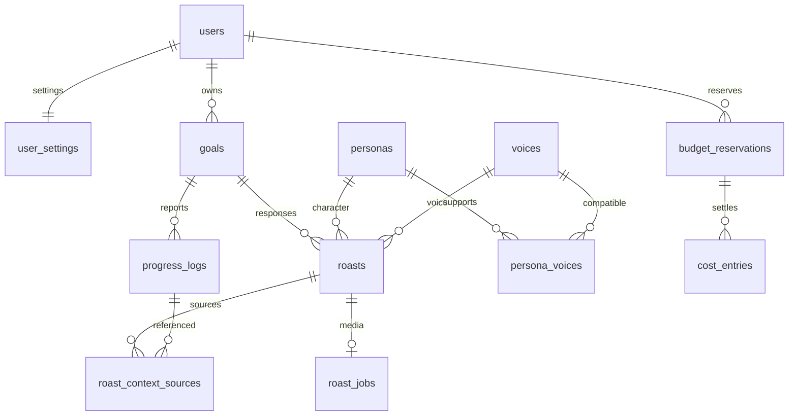
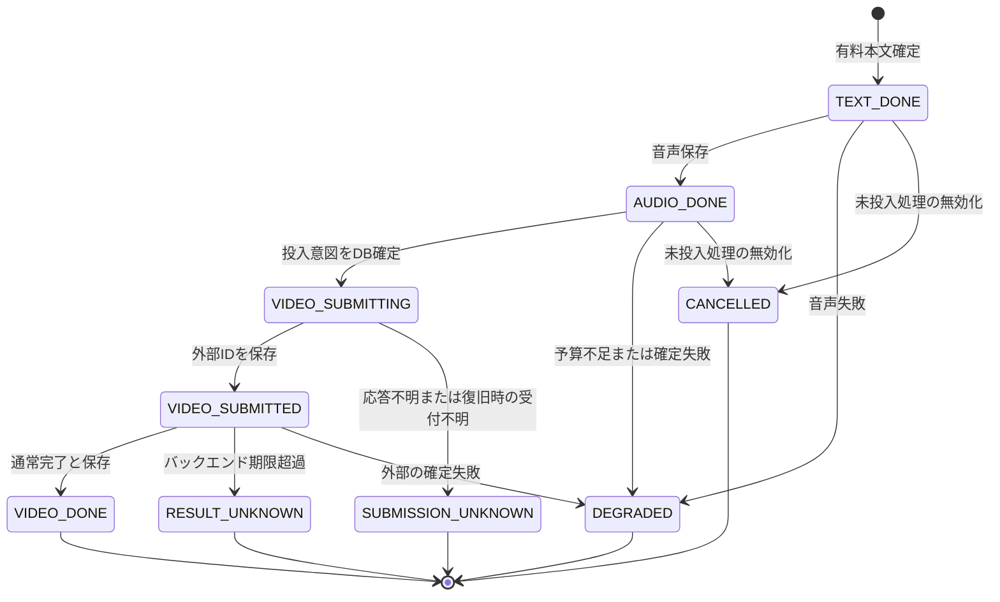

# 04. データモデル設計

> 更新日: 2026-09-08。PostgreSQL + Flyway。未実装の設計であり、以下のマイグレーションを適用済みではない。

## 1. 関係と原則

個人データは `user_id` と所有者検証を持つ。マスタとアプリ全体の生成枠はユーザー非依存。本文の表示資格とジョブの実行状態を分離する。無料応答にはメディアジョブを作らず `TEXT_ONLY` として返す。費用集計は本文の削除に連動させない。

## 2. テーブル

### 2.1 users / user_settings

`users`: id UUID PK、username UNIQUE、password_hash（平文禁止）、display_name、external_sub nullable（将来OIDC）、created_at。本人1行を安全に初期投入する。

| user_settings | 型・制約 | 用途 |
|---|---|---|
| user_id | UUID PK/FK | 本人 |
| roast_intensity | text、MILD/NORMAL/SAVAGE、既定NORMAL | 停止とは独立 |
| persona_id / voice_id | text FK | 初期版は固定値、将来の選択に備える |
| manual_paused | boolean、既定false | 手動停止 |
| auto_paused | boolean、既定false | 深刻な危険入力による停止、時間だけではfalseにしない |
| resume_allowed_at | timestamptz nullable | 自動停止から24時間後の解除可能時刻 |
| revision | bigint | 停止・強度変更と生成公開の競合検出 |
| timezone | text、Asia/Tokyo | 初期版は固定 |
| updated_at | timestamptz | |

### 2.2 personas / voices / persona_voices

`personas`: id（初期版rival）、name、description、prompt_key、avatar_image_key、default_voice_id FK、is_active。

`voices`: id、provider、provider_speaker_id、name、credit_text、usage_terms_url、terms_checked_at、is_active。初期版は条件確認済みの1件。人格マスタにVOICEVOX話者を直結しない。

`persona_voices`: persona_id + voice_idの複合PK。対応する組み合わせを表現。標準音声も対応表に含める。初期版では固定の1組だけを投入し、将来の選択UIは作らない。

### 2.3 goals

id、user_id FK、title（1〜100字）、success_criteria（必須1〜1000字）、description（最大1000字）、category、deadline（date nullable）、status（ACTIVE/ACHIEVED/ABANDONED）、achieved_at、abandoned_at、created_at、updated_at、revision。

宣言は作成後不変。期限延長回数や編集履歴は初期版では不要。期限経過は状態遷移を起こさない。ユーザー操作でACTIVE→ACHIEVED/ABANDONED、終了状態からの再開は初期版に含めない。

索引: `(user_id, status, created_at DESC)`。

### 2.4 progress_logs

id、goal_id FK、user_id FK、body（トリム後1〜1000字）、progress_category（DONE/PARTIAL/NOT_DONE/REST/UNWELL）、request_video（boolean）、created_at、deleted_at nullable。

編集しない。削除は論理削除で参照関係を保持し、全通常読み取りと生成文脈から除外する。削除済み本文の物理消去方針は保持運用と分ける（§6）。索引: `(goal_id, created_at DESC) WHERE deleted_at IS NULL`。

### 2.5 roasts / roast_context_sources

| roasts | 用途 |
|---|---|
| id、user_id、goal_id、progress_log_id nullable UNIQUE | 生成元。目標作成・達成はprogressなし |
| trigger | GOAL_DECLARED / PROGRESS_REPORTED / GOAL_ACHIEVED / PAUSED_RESPONSE |
| response_kind | TAUNT / NEUTRAL / VICTORY。停止時に表示可能かを判定 |
| persona_id、voice_id | 生成時の組み合わせ。過去のクレジットを変えない |
| intensity、settings_revision | 生成開始時の設定 |
| body nullable、emotion | 生成中はnull可。確定した本文は書き換えない |
| response_status | PENDING / TEXT_ONLY / DEGRADED / FAILED。メディアジョブがある場合、公開statusはジョブ状態から取得 |
| visibility | VISIBLE / SUPPRESSED（非表示は不可逆） |
| suppression_reason、suppressed_at | STOPPED / INTENSITY_LOWERED / GOAL_CLOSED / SOURCE_DELETED |
| provider、model、prompt_version、template_id | 生成方式と再現情報 |
| input_tokens、output_tokens、latency_ms、moderation_status | 計装。費用の正本は台帳 |
| created_at | |

`roast_context_sources`: roast_id + progress_log_id 複合PK、FK。現在の投稿と、実際に渡す過去報告を**外部LLM呼び出し前**に登録する。無料応答も現在の報告を参照登録する。過去の煽り本文は文脈に使わないため、引用の推移閉包を別途計算する必要を減らす。

報告削除は、生成中を含む参照先roastをすべてSUPPRESSEDにする。同一トランザクションまたは入力ロックと世代確認で「削除後に新しい参照を登録する」競合を防ぐ。後続progressは変更しない。索引: `roast_context_sources(progress_log_id, roast_id)`、`roasts(goal_id, created_at DESC)`。

### 2.6 roast_jobs

| カラム群 | 用途 |
|---|---|
| roast_id PK/FK、status | 任意メディア処理の状態 |
| audio_key、audio_duration_ms、video_key | 非公開R2キー、実測尺 |
| external_job_id nullable、submission_started_at | 外部受付と投入開始の記録 |
| result_deadline_at | 実測に基づくバックエンド打ち切り期限。updated_atで延長しない |
| video_provider、video_model、video_credits | 外部結果 |
| lease_owner、lease_expires_at、lease_version | ワーカーの排他と条件付き更新 |
| last_error_code、attempt_count、degraded_reason | 運用・再試行記録。本文は入れない |
| late_result_status、late_external_job_id、reconciled_at | 不明終了後の確認。通常表示へ自動復活させない |
| created_at、updated_at | |

### 2.7 generation_slot

singleton_id PK（アプリに1行）、operation_id nullable、lease/revision。予約の短いトランザクション内でロックし、有料パイプライン1件を確保。単なるスレッド数制限では代用しない。正常終了・縮退・未投入取消・不明終了で解放する。既知の外部処理中は、表示を抑止しても結果または打ち切りまで枠を保持する。

### 2.8 budget_reservations / cost_entries

金額は `bigint` micro USD（1ドル=1,000,000）、非負制約。浮動小数を使わない。

`budget_reservations`: id、user_id、operation_id、budget_day（Asia/Tokyoの日付）、budget_month（月初日）、estimated_micro_usd、outstanding_micro_usd、status（RESERVED/UNKNOWN/SETTLED/RELEASED）、created_at、updated_at。月次上限は20,000,000、日次は実測後設定。

`cost_entries`: id、reservation_id、attempt_id UNIQUE、stage（LLM/SPEECH/VIDEO）、provider、model、actual_micro_usd、entry_kind（CHARGE/REFUND）、usage_metadata、confirmed_at。失敗・非表示の有料試行も記録し、確定費用は上書き削除しない。修正・返金は元エントリを参照する調整エントリとして追跡可能にする。金額の絶対値は非負、entry_kindで加減算を区別する。

ユーザーの予算ロック下で日次・月次の「確定実費 + 未精算予約 + 今回予約」を検査し、枠確保と同時コミット。精算した段の予約は実費へ置き換え、二重加算しない。返金や未課金確認がない失敗を費用0と見なさない。

開始日/月を会計帰属とし、境界をまたぐ未精算予約は現在の期間にも持ち越しブロック額として算入する。元期間と一致するときは重複加算しない。確定実費を元期間へ精算したら現在期間のブロックを解除する。単に日/月が変わっただけでは不明予約を解放しない。外部請求書とアプリの利用予算集計は別に照合する。

### 2.9 idempotency_keys

user_id + keyの複合PK、request_hash、operation_id、state（IN_PROGRESS/COMPLETED/UNKNOWN）、resource_ids、status_code、created_at。確定結果は24時間保持。未解決の有料操作はキー期限だけで新規生成として再実行しない。応答を再構築するときは現在の非表示・削除・停止を反映する。

怒りゲージ・リアクションのテーブルは後続で追加。初期版のmigrationには含めない。

## 3. ジョブ状態遷移

投入前の文生成失敗は無料定型文へ縮退。外部受付済みならSUPPRESSEDでも状態確認・費用精算を続ける。不明状態から遅れて成果が届いても `VIDEO_DONE` に自動遷移させず、late_result欄に記録。表示可能な音声・テキストは残すが、停止・削除で無効化されていれば返さない。

## 4. 安全状態

停止判定は `manual_paused OR auto_paused`。深刻な危険入力でauto_paused=true、resume_allowed_at=検知時刻+24時間。解除は期限経過後の明示操作のみ。手動停止の解除だけで自動停止を迂回しない。体調不良・疲労のみではauto_pausedを立てない。

## 5. メディア

`avatar/{personaId}`、`audio/{roastId}.wav`、`video/{roastId}.mp4`。URLはDBに保存せず、認証済みメディア経路で毎回公開資格を判定する。確定した本文・音声に対するキーを使い、旧ワーカーによる上書きは世代検証で防ぐ。使用量は実測し、無料枠内に収まるとは断定しない。

## 6. 保持・マイグレーション

論理削除はアプリの非表示・文脈除外を保証するもので、即時の物理消去を意味しない。初期版では削除済み本文・メディアは通常APIからアクセス不可。物理消去はR2/DB/バックアップの整合を含む運用手順で行い、コスト台帳と参照IDは保持する。本文・プロンプトはログに保存しない。アプリログは旧方針の30日を目安とする。

migrationの順序: users → voices/personas/対応表 → settings/本人seed → goals → progress → roasts/文脈参照 → jobs/生成枠 → 予算/費用台帳 → 冪等キー。相互FKがある標準音声等は作成・seed順を調整する。既適用migrationを書き換えず追加方式。本番cleanは禁止。
