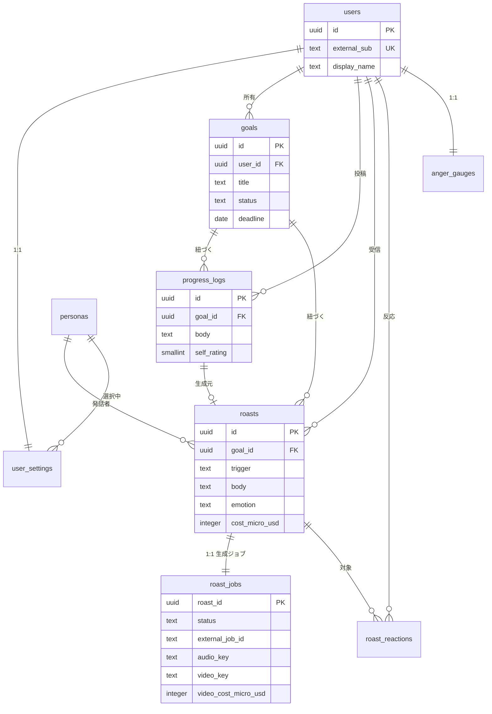
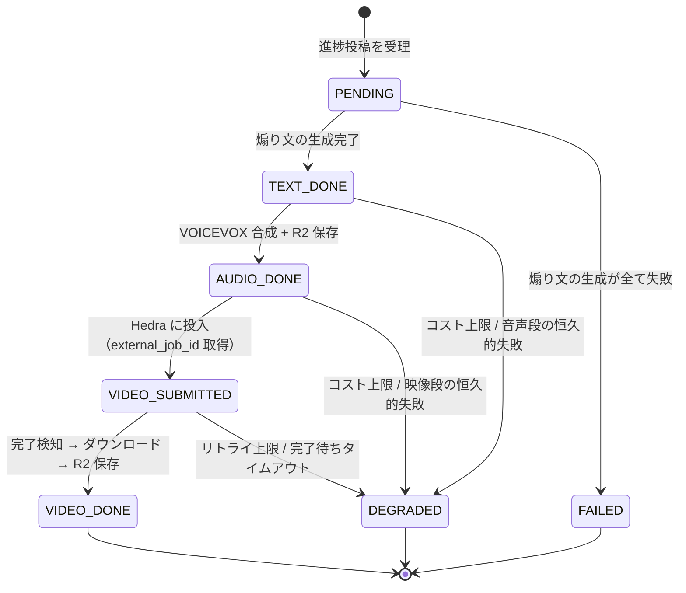
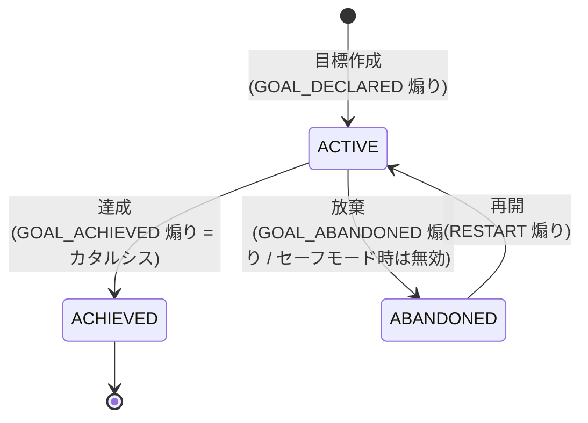
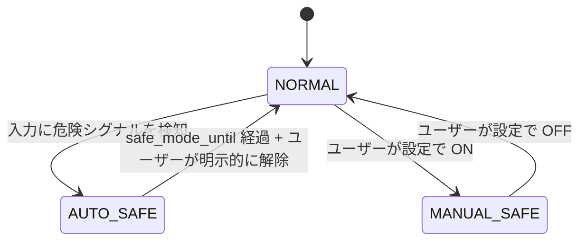

# 04. データモデル設計

> **v1 のスコープと、削った機能の理由は [README](./README.md) を参照。**

DBMS は PostgreSQL 16 を前提とする。マイグレーションは Flyway。

**v1 は単一ユーザーだが、`user_id` 外部キーは全テーブルに持つ。** 【将来】複数ユーザー化のときにクエリを書き換えずに済ませるため。実行コストはほぼゼロで、後から足すと全テーブルに影響する。

---

## 1. ER 図



**`roasts` と `roast_jobs` を分ける理由**: `roasts` は**確定した成果物**（本文・感情・LLM のコスト）で、生成後は不変。`roast_jobs` は**進行中の可変状態**で、パイプラインが数十回書き換える。ライフサイクルが違うものを同居させると、タイムラインの読み取りが更新頻度の高い行と競合する。

---

## 2. テーブル定義

### 2.1 `users`

| カラム | 型 | 制約 | 説明 |
|---|---|---|---|
| `id` | `uuid` | PK | UUID v7 |
| `external_sub` | `text` | UNIQUE | 【将来】OIDC の `iss` + `sub`。**v1 は NULL**（Basic 認証のため） |
| `username` | `text` | NOT NULL, UNIQUE | Basic 認証のユーザー名 |
| `password_hash` | `text` | NOT NULL | BCrypt。**平文は保存しない** |
| `display_name` | `text` | NOT NULL | |
| `created_at` / `updated_at` | `timestamptz` | NOT NULL | |
| `deleted_at` | `timestamptz` | | 【将来】論理削除 |

**v1 では Flyway の seed で1行だけ投入する。** 認証済みリクエストは常にこの1行に解決される。

### 2.2 `user_settings`

| カラム | 型 | 制約 | 説明 |
|---|---|---|---|
| `user_id` | `uuid` | PK, FK→users | |
| `roast_intensity` | `text` | NOT NULL, DEFAULT `'NORMAL'` | `MILD` / `NORMAL` / `SAVAGE` / `NONE` |
| `persona_id` | `text` | NOT NULL, FK→personas | |
| `llm_provider` | `text` | NOT NULL, DEFAULT `'anthropic'` | **`anthropic` / `openai` / `template`。画面から切り替えて比較する**（Q15） |
| `video_enabled` | `boolean` | NOT NULL, DEFAULT true | **手動で動画生成を止めてコストを節約できる** |
| `safe_mode` | `boolean` | NOT NULL, DEFAULT false | 手動で有効化した穏当モード |
| `safe_mode_until` | `timestamptz` | | セーフモード自動発動時の解除予定時刻 |
| `timezone` | `text` | NOT NULL, DEFAULT `'Asia/Tokyo'` | 日次上限の「日付」境界に使う |
| `updated_at` | `timestamptz` | NOT NULL | |

【将来】`notify_stalled` / `notify_deadline` / `quiet_hours_*` — v1 では通知を持たない。

### 2.3 `personas`

マスタ。コード同梱の seed（Flyway の `V*__seed_personas.sql`）で投入する。

| カラム | 型 | 説明 |
|---|---|---|
| `id` | `text` PK | `rival` / `senpai` / `osananajimi`（**v1 は1件のみ有効**） |
| `name` | `text` | 表示名 |
| `description` | `text` | キャラ紹介 |
| `prompt_key` | `text` | `classpath:prompts/persona/{key}.md` を指す |
| **`avatar_image_key`** | `text` | **R2 上のアバター静止画のキー。Hedra に渡す元画像** |
| **`voicevox_speaker_id`** | `integer` | **VOICEVOX の話者 ID。声とキャラを紐づける** |
| **`voicevox_credit`** | `text` | **クレジット表記（例 `VOICEVOX:ずんだもん`）。UI に必ず出す** |
| `sort_order` | `integer` | |
| `is_active` | `boolean` | v1 で使う1件のみ true |

**プロンプト本文を DB に置かない**理由: プロンプトはコードと同じくレビュー・差分管理・ロールバックの対象であり、Git 管理下のリソースファイルに置く方が運用が安全。DB にはキーのみ持たせる。

> **`voicevox_credit` をテーブルに持つ理由**: VOICEVOX はキャラクターごとにクレジット表記が求められる。**表記漏れは規約違反になりうる**ため、ペルソナのデータとして持ち、UI で必ず描画する。話者を追加したときの表記忘れを構造的に防ぐ。

### 2.4 `goals`

| カラム | 型 | 制約 | 説明 |
|---|---|---|---|
| `id` | `uuid` | PK | |
| `user_id` | `uuid` | NOT NULL, FK | |
| `title` | `text` | NOT NULL, CHECK `length(title) BETWEEN 1 AND 100` | |
| `description` | `text` | CHECK `length <= 1000` | |
| `category` | `text` | NOT NULL | `STUDY`/`HEALTH`/`WORK`/`HABIT`/`CREATIVE`/`OTHER` |
| `status` | `text` | NOT NULL, DEFAULT `'ACTIVE'` | `ACTIVE` / `ACHIEVED` / `ABANDONED` |
| `deadline` | `date` | | |
| `deadline_extended_count` | `integer` | NOT NULL, DEFAULT 0 | 後ろ倒し回数。煽り材料 |
| `last_progress_at` | `timestamptz` | | 経過日数の計算を高速化する非正規化 |
| `achieved_at` / `abandoned_at` | `timestamptz` | | |
| `created_at` / `updated_at` | `timestamptz` | NOT NULL | |

インデックス:
- `idx_goals_user_status ON goals(user_id, status, created_at DESC)`
- 【将来】`idx_goals_stalled` / `idx_goals_deadline` — 停滞検知・期限通知バッチ用の部分インデックス

### 2.5 `progress_logs`

| カラム | 型 | 制約 | 説明 |
|---|---|---|---|
| `id` | `uuid` | PK | |
| `goal_id` | `uuid` | NOT NULL, FK | |
| `user_id` | `uuid` | NOT NULL, FK | 非正規化 |
| `body` | `text` | NOT NULL, CHECK `length BETWEEN 1 AND 1000` | |
| `self_rating` | `smallint` | NOT NULL, CHECK `BETWEEN 1 AND 5` | |
| `kind` | `text` | NOT NULL, DEFAULT `'REPORT'` | `REPORT` / `DECLARATION` |
| `created_at` | `timestamptz` | NOT NULL | |

インデックス: `idx_progress_goal_created ON progress_logs(goal_id, created_at DESC)`

### 2.6 `roasts` ★確定した成果物

| カラム | 型 | 制約 | 説明 |
|---|---|---|---|
| `id` | `uuid` | PK | |
| `user_id` | `uuid` | NOT NULL, FK | |
| `goal_id` | `uuid` | FK | |
| `progress_log_id` | `uuid` | FK, UNIQUE | 進捗起因の煽りは 1:1 |
| `trigger` | `text` | NOT NULL | `GOAL_DECLARED` / `PROGRESS_REPORTED` / `GOAL_ACHIEVED` / `GOAL_ABANDONED` / `DEADLINE_EXTENDED` / `SAFE_MODE` |
| `persona_id` | `text` | NOT NULL, FK | 生成時点のペルソナ（後で変更されても履歴は変わらない） |
| `intensity` | `text` | NOT NULL | 生成時点の強度 |
| `body` | `text` | NOT NULL | 煽り本文 |
| `emotion` | `text` | NOT NULL | `SMIRK`/`ANGRY`/`BORED`/`SURPRISED`/`RELUCTANT_PRAISE`/`WORRIED`/`NEUTRAL` |
| **生成メタデータ** | | | ↓ コスト・品質分析の生命線。必ず埋める |
| `provider` | `text` | NOT NULL | `anthropic` / `openai` / `template` |
| `model` | `text` | | `claude-opus-5` 等 |
| `prompt_version` | `text` | NOT NULL | プロンプトのバージョン。比較と回帰分析に使う |
| `input_tokens` | `integer` | | |
| `output_tokens` | `integer` | | |
| `cache_read_tokens` | `integer` | | プロンプトキャッシュ効果の計測用 |
| `cost_micro_usd` | `integer` | | 1e-6 USD 単位の整数（浮動小数を避ける） |
| `latency_ms` | `integer` | | |
| `moderation_status` | `text` | NOT NULL, DEFAULT `'PASSED'` | `PASSED` / `RETRIED` / `FALLBACK` |
| `fallback_reason` | `text` | | |
| `created_at` | `timestamptz` | NOT NULL | |

インデックス:
- `idx_roasts_goal_created ON roasts(goal_id, created_at DESC)` — タイムライン
- `idx_roasts_user_created ON roasts(user_id, created_at DESC)`
- `idx_roasts_cost_daily ON roasts(created_at)` — 日次コスト集計
- `idx_roasts_provider ON roasts(provider, model, created_at DESC)` — **プロバイダ比較の集計用**（[03 §3.9](./03-api-design.md)）

> **設計意図**: 「プロバイダを実測コストで比較する」という前提がある以上、`provider` / `model` / `token` / `cost` / `latency` / `prompt_version` を全レコードに残すことが**要件**である。これがないと Q15 の比較ができない。**この計装そのものが本設計の主要な成果物のひとつ。**

### 2.7 `roast_jobs` ★進行中の可変状態

**非同期パイプラインの心臓部。** この 1 テーブルが「途中で落ちても再開できる」を成立させる。

| カラム | 型 | 制約 | 説明 |
|---|---|---|---|
| `roast_id` | `uuid` | PK, FK→roasts | 煽りと 1:1 |
| `user_id` | `uuid` | NOT NULL, FK | 日次集計用の非正規化 |
| `status` | `text` | NOT NULL | §3.1 の状態遷移 |
| `degraded_reason` | `text` | | `DAILY_COST_LIMIT` / `SPEECH_FAILED` / `VIDEO_FAILED` / `VIDEO_TIMEOUT` |
| **音声段** | | | |
| `audio_key` | `text` | | R2 のキー（例 `audio/{roastId}.wav`）。**署名付き URL は保存しない** |
| `audio_duration_ms` | `integer` | | Hedra に渡す音声長。動画コストの見積もりにも使う |
| `speech_latency_ms` | `integer` | | |
| **映像段** | | | |
| **`external_job_id`** | `text` | | **Hedra 側のジョブ ID。★このカラムが再開可能性の中核** |
| `video_key` | `text` | | R2 のキー（例 `video/{roastId}.mp4`） |
| `video_bytes` | `bigint` | | R2 の容量監視用 |
| `video_provider` | `text` | | `hedra`（【将来】差し替え時に記録が残る） |
| `video_model` | `text` | | `character-3` |
| `video_credits` | `integer` | | 消費クレジット（**P0 で実測して単価を確定する**） |
| `video_cost_micro_usd` | `integer` | | 日次コスト集計に加算される |
| `video_latency_ms` | `integer` | | **投入から完了までの実測時間。段階表示のタイムアウト値を決める根拠になる** |
| **制御** | | | |
| `attempt_count` | `integer` | NOT NULL, DEFAULT 0 | 復旧スケジューラによる再開回数。上限で `DEGRADED` へ |
| `last_error` | `text` | | 直近の失敗理由（本文は含めない） |
| `created_at` / `updated_at` | `timestamptz` | NOT NULL | **`updated_at` が停滞判定の基準** |

インデックス:
- `idx_roast_jobs_recovery ON roast_jobs(status, updated_at) WHERE status IN ('PENDING','TEXT_DONE','AUDIO_DONE','VIDEO_SUBMITTED')` — **復旧スケジューラ用の部分インデックス**
- `idx_roast_jobs_cost_daily ON roast_jobs(user_id, created_at)` — 日次コスト集計

**ジョブの取得は `SELECT ... FOR UPDATE SKIP LOCKED`** で行い、`@Async` 本体と `@Scheduled` 復旧が同じジョブを二重処理しないようにする（[02 §5.3](./02-architecture.md)）。

> **`external_job_id` を永続化することが、この設計で最も価値のある 1 カラム**である。Hedra への投入は課金が発生する。これを保存していないと、プロセス再起動のたびに支払い済みの動画生成が行方不明になる。保存してあれば、再起動後は「投入せずに状態取得だけ」から再開できる。

### 2.8 `roast_reactions`

| カラム | 型 | 制約 |
|---|---|---|
| `id` | `uuid` | PK |
| `roast_id` | `uuid` | NOT NULL, FK |
| `user_id` | `uuid` | NOT NULL, FK |
| `reaction` | `text` | NOT NULL — `ANGRY` / `LAUGH` / `HURT` |
| `created_at` | `timestamptz` | NOT NULL |

- `UNIQUE (roast_id, user_id)` — 1煽り1リアクション（変更は upsert）

**このテーブルが Q15 の品質シグナル**になる。`provider` 別の `ANGRY + LAUGH` 率を出すために `roasts` と JOIN する。

### 2.9 `anger_gauges`

| カラム | 型 | 説明 |
|---|---|---|
| `user_id` | `uuid` PK, FK | |
| `value` | `smallint` | NOT NULL, CHECK `BETWEEN 0 AND 100` |
| `last_decayed_at` | `timestamptz` | 減衰計算の基準時刻 |
| `updated_at` | `timestamptz` | |

**減衰は遅延評価**にする。バッチで更新するのではなく、読み取り時に `last_decayed_at` からの経過時間で減算してから返す（`value - floor(経過時間/24h) * 20`、下限 0）。書き込み時に確定値を保存する。

### 2.10 `idempotency_keys`

| カラム | 型 | 説明 |
|---|---|---|
| `key` | `text` PK | クライアント生成 UUID |
| `user_id` | `uuid` | |
| `request_hash` | `text` | 同一キーで異なるボディなら 409 |
| `response_body` | `jsonb` | 再送時にそのまま返す |
| `status_code` | `smallint` | |
| `created_at` | `timestamptz` | 24時間で TTL 削除 |

**煽り生成は「二重生成 = 二重課金」**なので、Redis ではなく永続層に置く。動画を含む v1 では二重課金の金額が大きいため、この判断の重みが増した。

### 2.11 【将来】追加されるテーブル

v1 では作らない。設計だけ残す。

| テーブル | 用途 |
|---|---|
| `streaks` | 連続進捗報告日数 |
| `achievements` / `user_achievements` | 実績 |
| `push_subscriptions` | Web Push 購読 |

---

## 3. 状態遷移

### 3.1 ジョブのステータス ★中核



| 遷移 | 実行者 | 冪等性の担保 |
|---|---|---|
| `PENDING → TEXT_DONE` | `RoastOrchestrator`（同期） | `Idempotency-Key` |
| `TEXT_DONE → AUDIO_DONE` | `RoastPipeline`（`@Async`） | R2 のキーが決定的（`audio/{roastId}.wav`）なので上書きで安全 |
| `AUDIO_DONE → VIDEO_SUBMITTED` | `RoastPipeline` | **`external_job_id` が既にあればスキップ**（二重投入 = 二重課金の防止） |
| `VIDEO_SUBMITTED → VIDEO_DONE` | `RoastPipeline` または `RoastJobRecoveryScheduler` | R2 のキーが決定的 |
| `* → DEGRADED` | いずれか | 終端状態なので再入なし |

**`DEGRADED` は失敗ではなく正常終了の一種。** 「動画は作れなかったが、テキストと音声は届いた」という状態を、エラーではなく成果として扱う。

> **状態遷移図がここで初めて実際の意味を持つ。** 目標のステータス（§3.2）は CRUD の飾りに近いが、ジョブのステータスは**プロセスが落ちた後に、どこから再開するかを決める実行時の判断材料**である。

### 3.2 目標のステータス



- `ACHIEVED` からの遷移は不可（409）。「もっと上を目指す」場合は新しい目標を作る。
- `ABANDONED → ACTIVE` の再開は許す。ここで煽られるのが体験として面白い。

### 3.3 セーフモードの状態



**重要**: `AUTO_SAFE` は時間経過だけでは解除しない。必ずユーザーの明示的な操作を要求する（勝手に煽りを再開しない）。

---

## 4. オブジェクトストレージ（Cloudflare R2）

DB には**キーだけ**を保存し、URL は保存しない。署名付き URL はリクエストのたびに発行する。

| プレフィクス | 内容 | 例 |
|---|---|---|
| `avatar/` | ペルソナの静止画（Hedra に渡す元画像） | `avatar/senpai.png` |
| `audio/` | VOICEVOX が生成した WAV | `audio/018f2c3d-....wav` |
| `video/` | Hedra が生成した MP4 | `video/018f2c3d-....mp4` |

### 容量の見積もり

| 項目 | 概算 |
|---|---|
| 動画 1本（10秒） | 1〜2 MB |
| 音声 1本（10秒 WAV） | 約 1 MB（24kHz 16bit mono） |
| 1日 5本 × 365日 | 動画 約 3 GB + 音声 約 2 GB |
| **R2 無料枠** | **10 GB / 月** |

**1年分が無料枠に収まる。** かつ R2 は **egress 無料**なので、再生のたびに転送料が発生しない。

> **Hedra の `download_url` をそのまま保存しない理由**: 有効期限が公開ドキュメントに記載されていない。切れた瞬間に過去の履歴が全部再生できなくなる。**「過去に煽られた動画を見返せる」ことが Character-3（非同期）を選んだ理由**なので、ここを外部 URL に依存させると選択の意味が半分消える。

---

## 5. データ保持とプライバシー

| データ | 保持期間 | 備考 |
|---|---|---|
| `progress_logs.body` | 削除するまで | 機微情報を含みうる |
| `roasts.body` | 削除するまで | |
| 音声 / 動画 | 削除するまで | R2 無料枠の 10GB に近づいたら古いものから削除する運用 |
| LLM へ送るプロンプト | **保存しない** | 再現が必要な場合は `prompt_version` + 入力 ID から再構築する |
| アプリケーションログ | 30日 | **進捗本文・煽り本文はログに出さない**（ID のみ） |

LLM プロバイダ側の設定として、**入力データの学習利用をオフ**にできる設定を必須要件とする。

---

## 6. マイグレーション運用

```
db/migration/
├── V1__create_users_and_settings.sql
├── V2__create_personas.sql
├── V3__seed_personas.sql            # avatar_image_key / voicevox_speaker_id / voicevox_credit を含む
├── V4__seed_single_user.sql         # v1 の Basic 認証ユーザー1件
├── V5__create_goals.sql
├── V6__create_progress_logs.sql
├── V7__create_roasts.sql
├── V8__create_roast_jobs.sql        # ★ 非同期パイプラインの状態
├── V9__create_reactions_and_gauge.sql
└── V10__create_idempotency.sql
```

- 本番は `flyway.validate-on-migrate=true`、`clean` は無効化。
- **Railway では起動時にアプリがマイグレーションを実行する**（単一インスタンスなので競合しない）。【将来】複数インスタンス化する場合は、起動前の単独ジョブに分離する。
- 破壊的変更は「追加 → 二重書き → 切替 → 削除」の 4段階に分けて行う。
