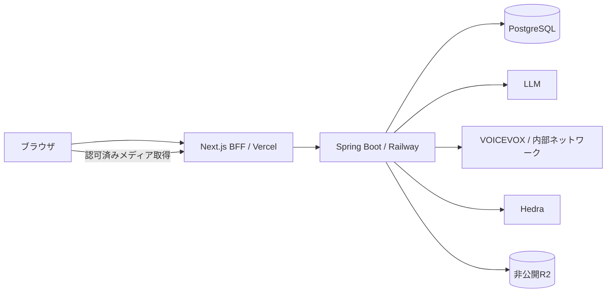

> **旧動画生成方式の設計・検証記録（2026-09-19に保存）。新規開発の指示ではありません。** 現行方針は [現行ドキュメント](../README.md) を参照してください。

# 02. アーキテクチャ設計

> 更新日: 2026-09-08。仕様の正本は [README](./README.md)、状態定義は [04](./04-data-model.md)。

## 1. 構成と技術方針



| 領域 | 方針 |
|---|---|
| バックエンド | Java 17、Spring Boot 4.1系 / Spring MVCを既存候補として維持。対応パッチ・依存APIは初回ビルド前に確認 |
| 永続化 | PostgreSQL 16、Spring Data JPA、局所的なJdbcClient、Flyway |
| フロント | TypeScript strict、Next.js App Router、React、Tailwind、TanStack Query、Zod |
| 外部連携 | Claudeを最初の有料LLM候補、VOICEVOX、Hedra Character-3、S3互換R2 |
| HTTP | SDKはアダプタ内部に限定。その他はRestClient/HTTP Service Clientを候補とする |
| 実行 | 専用ThreadPoolTaskExecutor + `@Async`、DB駆動の`@Scheduled`復旧 |
| 認証 | ブラウザ→BFF、BFF→Springの別資格情報によるBasic認証 |
| テスト | JUnit、ArchUnit、Testcontainers、WireMock、Vitest。APIテストクライアントは採用Bootとの互換性を検証 |
| 運用 | Vercel + Railway。GitHub Actionsでビルド・検証、デプロイはGit連携 |

従来のモデル名・SDKメソッド・価格・ライブラリの「最新」表記は確定仕様ではない。具体的な依存は公式資料とビルドで確認し固定する。Spring/JacksonとLLM SDKの型をドメインに持ち込まない。Java 17で仮想スレッドは前提にしない。

## 2. 境界とパッケージ

```text
com.example.roastme/
  config/                 認証・外部接続・実行器
  goal/                   目標・勝利条件・達成・取りやめ
  progress/               区分・本文・削除
  roast/                  生成・表示資格・文脈参照・復旧
  persona/                人格・画像
  voice/                  音声マスタ・対応関係・クレジット
  budget/                 予約・精算・生成枠
  safety/                 停止・強度・入力/出力ガード
```

各機能内は `api → application → domain ← infrastructure`。ドメインはSpring・SDKに依存しない。外部ポートは `RoastGenerator`、`SpeechSynthesizer`、`AvatarVideoGenerator`、`MediaStorage`、`RoastModerator`。LLMは有料1実装 + テンプレートを初期版で用意し、OpenAI比較実装・画面は後続にする。

## 3. 投稿の同期処理

1. 認証・所有者・入力・目標ACTIVEを確認し、冪等キーを確保する。
2. 目標作成または進捗を保存。深刻な危険の入力判定を行う。疲労・休養のみでは停止しない。
3. 通常投稿・停止中・動画利用不可は外部AIを呼ばず定型文で完了。
4. 動画希望は、短いDBトランザクションでアプリ全体の生成枠と日次/月次予算を同時に確保する。どちらか不可なら予約も枠も取らず定型文。
5. 目標宣言・現在の報告・直近の有効な報告（最大3件）を取得し、使用する入力IDを生成開始前に記録する。過去の煽り本文は入力に使わず、削除情報の間接引用を防ぐ。
6. 有料LLMを呼び本文を検査する。停止・削除等の競合を再確認し、表示可能な本文だけを同期返却する。
7. DBに本文とジョブを確定後、コミット後イベントで非同期処理を起動。起動に失敗しても復旧スケジューラが拾う。

通常/無料応答は201、非同期生成が残る応答は202。達成・取りやめ・設定は200。具体的な形は [03](./03-api-design.md)。LLM失敗は無料定型文に縮退し、音声・動画へ進めない。実施した有料試行の費用は記録する。

## 4. 非同期・復旧・二重投入防止

`TEXT_DONE → AUDIO_DONE → VIDEO_SUBMITTING → VIDEO_SUBMITTED → VIDEO_DONE`。

音声は確定本文から生成してR2に保存し、実際の尺で動画見積もりを再確認する。追加予約できなければ、その時点までの成果で `DEGRADED`。動画投入の直前に **`VIDEO_SUBMITTING` をコミットしてから** 外部APIを呼ぶ。外部IDが返ったら `VIDEO_SUBMITTED` として永続化する。

| 復旧時の状態 | 処理 |
|---|---|
| `TEXT_DONE` / `AUDIO_DONE` | 未実行の段から再開。毎回停止・削除・予算を確認 |
| `VIDEO_SUBMITTING` で生存ワーカーなし | 投入前に落ちた可能性も含め受付不明。`SUBMISSION_UNKNOWN` にし、自動再送しない |
| `VIDEO_SUBMITTED` と外部IDあり | 状態取得・ダウンロード・保存のみ再開。投入を再実行しない |
| `SUBMISSION_UNKNOWN` | テキスト・音声までで終了、枠解放、予約保持。運用確認対象 |
| `RESULT_UNKNOWN` | 枠解放、予約保持。遅延結果で通常の完了状態へ自動復帰しない |
| `VIDEO_DONE` / `TEXT_ONLY` / `DEGRADED` / `FAILED` / `CANCELLED` | 自動で新しい生成を開始しない |

外部APIとDBを単一トランザクションにできないので、exactly-onceを保証しない。不明時に再送しないことで重複生成を避ける。ID保存だけで二重課金を完全に防げる、とは主張しない。

短いトランザクションで `FOR UPDATE SKIP LOCKED` によるジョブ取得とリースを確保し、外部HTTP中はDBロックを保持しない。更新はリース所有者・世代・期待状態の条件付き更新。期限切れワーカーが戻っても再投入・表示復活できないようにする。呼び出し開始前にもリースを再確認する。

アプリ全体の動画枠は1行のDBロックで確保し、複数タブ・復旧ワーカーにも適用する。待ち行列なし。不明として枠解放後、外部には以前の処理が残りうるため、外部実行件数が常に1件とは保証しない。

画面の3分待機とバックエンドの `result_deadline_at` は別物。後者は実測後に設定し、更新時刻が変わっても期限を延長しない。超過で `RESULT_UNKNOWN`。遅延結果は監査・精算のみ更新し、音声・動画の通常表示を自動解禁しない。

## 5. 表示資格と競合

生成状態と `visibility` を分離する。各操作は目標・設定世代・入力参照をロックまたは世代照合し、対象を `SUPPRESSED` にする。

- 停止・強度低下: 対象の実行中生成を無効化し、未着手の段を止める。
- 達成・取りやめ: 対象目標で未完了の煽りを無効化。勝利文は別に作成。
- 削除: 報告と、それを参照する全煽りを無効化。後続報告は削除しない。
- 外部処理を中止できなくても、応答の公開直前と全読み取りAPIで再確認する。
- 投稿の同期LLM中にも参照を記録済みとし、削除済み入力から後で本文を公開する競合を防ぐ。

停止解除で既に無効化した煽りは復活しない。表示済み内容を人の記憶や保存済みファイルから回収する保証はしない。

## 6. 費用とメディア

予算予約・精算の詳細は [04](./04-data-model.md)、[05](./05-llm-design.md)。コスト集計は削除されうる成果物から独立した台帳で行う。有料処理全体の見込みを先に確保し、段ごとに実費へ置換する。

旧設計の1時間有効なR2直リンクは、停止・削除後の新規アクセスを止めにくい。初期版のメディア取得は認証済みBFF/Springの経路で毎回表示資格を確認し、R2からストリームする。Rangeリクエスト・タイムアウト・配信制限は実装時に検証。R2キーはDB保存、署名URLをクライアントに長期キャッシュさせない。

## 7. 認証・障害方針

BFFはパス・メソッドを許可リスト化し、利用者認証を通した場合だけサーバ資格情報でSpringに接続。状態変更にはOrigin検証等のCSRF対策を行う。Basic認証だからCSRF不要とはしない。所有者不一致は404。シークレットは環境変数から取得し、seedに平文パスワードを書かない。

外部ジョブ投入の包括的な自動リトライを禁止。状態取得・ダウンロードは期限内でバックオフ再試行。有料LLMの再試行も費用と時間の範囲内で、無料テンプレートを常に用意する。出力検査を通る前に音声化しない。
